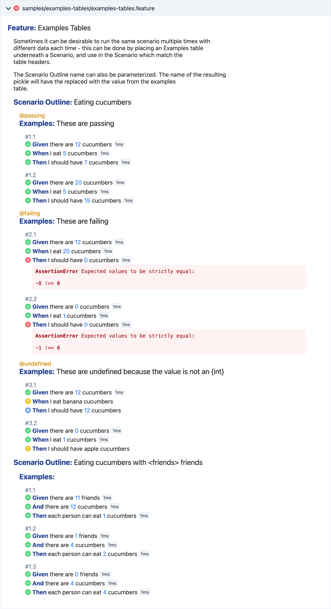

# @cucumber/react-components

> A set of React components for rendering Gherkin documents and Cucumber results.

Preview and examples:  
https://cucumber-react-preview.netlify.app/



## Usage

- This package is distributed in ES module format only.
- React 18 or above is required.

The source code for the screenshot above is:

```jsx
import { EnvelopesProvider, GherkinDocumentList } from '@cucumber/react-components'

<EnvelopesProvider envelopes={envelopes}>
  <GherkinDocumentList />
</EnvelopesProvider>
```

`envelopes` should be an array of [Cucumber Messages](https://github.com/cucumber/messages) that came from a test run. You can obtain these from most Cucumber implementations by using a "Message" formatter.

## Attachments

Attachments from test runs are shown with their corresponding steps. The baseline behavior for attachments is a download button. However, we have some special handling for common MIME types to make them more useful without leaving the report:

- `image/*` - images are rendered with an `` tag
- `video/*` - videos are rendered with a `<video/` tag
- `text/x.cucumber.log+plain` - logs (from calls to the `log` function in Cucumber) are rendered as monospace text, and support ANSI colors
- `text/uri-list` - one or more URLs are rendered as links that open in a new tab
- `application/json` - JSON is rendered as monospace text and prettified
- `text/*` - other text types are rendered as monospace text

## Styling

The standard styling comes without any extra providers or configuration. There are several ways you can apply different styling to the components.

### Theming

You can provide your own theme with a small amount of CSS. Target the element above your highest-level usage of the components:

```jsx
<div className="dark-theme">
  <GherkinDocument />
</div>
```

In your CSS, you can set the background and text colors, and override the supported [custom property](https://developer.mozilla.org/en-US/docs/Web/CSS/--*) values as desired:

```css
.dark-theme {
  background-color: #1d1d26;
  color: #c9c9d1;
  --cucumber-anchor-color: #4caaee;
  --cucumber-keyword-color: #d89077;
  --cucumber-parameter-color: #4caaee;
  --cucumber-tag-color: #85a658;
  --cucumber-docstring-color: #66a565;
  --cucumber-error-background-color: #cf6679;
  --cucumber-error-text-color: #222;
  --cucumber-code-background-color: #282a36;
  --cucumber-code-text-color: #f8f8f2;
  --cucumber-panel-background-color: #282a36;
  --cucumber-panel-accent-color: #313442;
  --cucumber-panel-text-color: #f8f8f2;
}
```

### Custom styles

For more control over the styling, you can override the CSS used by individual components.

Let's say you want to do something totally different with the typography of doc strings. In your own CSS, you might write something like:

```css
.acme-docstring {
  font-weight: bold;
  font-style: italic;
  background-color: black;
  color: hotpink;
  text-shadow: 1px 1px 2px white;
  padding: 10px;
}
```

Then, you can provide an `overrides` prop to the `CustomRendering` component, in the form of an object that declares which class names you're going to override and what with:

```jsx
<CustomRendering overrides={{
  DocString: {
    docString: 'acme-docstring'
  }
}}>
  <GherkinDocument />
</CustomRendering>
```

Some components have multiple styling hooks - e.g. the `<Tags>` component has the `tags` class name for the list, and the `tag` class name for each item. In these cases, you can provide custom class names for just the ones you want to change, and any you omit will pick up the built-in styling like normal.

### Custom rendering

To change the rendering of some components entirely, you can selectively provide your own component implementations to be used instead of the built-in ones.

Staying with the doc string example, you can use the same `overrides` prop, but this time instead of an object with class names, you provide a React functional component, giving you full control over the rendering:

```jsx
<CustomRendering overrides={{
  DocString: (props) => (
    <>
      <p>I am going to render this doc string in a textarea:</p>
      <textarea>{props.docString.content}</textarea>
    </>
  )
}}>
  <GherkinDocument />
</CustomRendering>
```

In each case where you provide your own component, it will receive the same props as the default component, plus two more:

- `styles` - class names for the default styling, so you can still apply these to your custom component if it makes sense
- `DefaultRenderer` - the default React component, useful if you only want to provide your own rendering for certain cases, and otherwise fall back to the default rendering (don't forget to pass it the props)